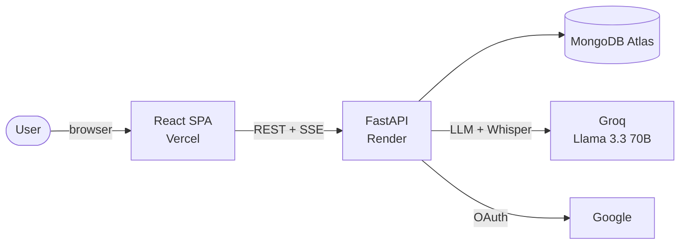

<div align="center">

# ✦ Lumina

### Where Intelligence Meets Opportunity

**A private atelier for the interview room** — AI-powered mock interviews that read your résumé, conduct cinematic voice-driven rehearsals, and return a boardroom-grade report before your next real one.

[](https://lumina-ai-virid-one.vercel.app)
[](https://lumina-ai-virid-one.vercel.app)
[](https://luminaai-1-7eq7.onrender.com/api)


**[🚀 Live App](https://lumina-ai-virid-one.vercel.app) · [📖 Features](#-features) · [🛠 Tech Stack](#-tech-stack) · [⚡ Getting Started](#-getting-started)**

</div>

---

## ✦ Overview

**Lumina** is a full-stack AI interview-preparation platform. Instead of generic practice questions, it runs a genuine interview: an AI counsel greets you by voice, adapts its questions to your résumé and target company, probes deeper as you answer, and afterward delivers a written report that pinpoints exactly where you lost points — then hands you a targeted plan for your next session.

It closes the loop most tools leave open: **interview → diagnosis → targeted practice → measurable improvement.**

> _"The room does not care how nervous you were. Talent is common — rehearsal is not."_

---

## ✦ Live Preview

<div align="center">

### 👉 **[Experience Lumina live → lumina-ai-virid-one.vercel.app](https://lumina-ai-virid-one.vercel.app)**

_Sign up with any email, or explore the AI interview, coach, and dashboard in seconds._

</div>

<!--
  📸 SCREENSHOTS — to add them, drop these files into docs/screenshots/ and then
  uncomment the grid below:
    landing.png · dashboard.png · interview.png · report.png · coach.png · profile.png
  See docs/screenshots/README.md for step-by-step instructions.

| Landing | Dashboard |
|:---:|:---:|
|  |  |

| AI Interview Room | Feedback Report |
|:---:|:---:|
|  |  |

| The Coach (AI Chat) | Candidate Profile |
|:---:|:---:|
|  |  |
-->

---

## ✦ Features

### 🎙️ AI Mock Interviews
- **Five formats** — technical, behavioral, coding, HR screen, and multi-person **panel** interviews
- **Real voice** — the AI counsel speaks each question aloud (browser speech synthesis) with a live "speaking" indicator; answer back by voice or text
- **Résumé-aware** — upload a PDF/DOCX and questions are grounded in your actual projects and experience
- **Company-tuned** — pick from **16 companies** (Google, Amazon, Meta, Microsoft, Apple, Netflix, Stripe, Anthropic, OpenAI, and more), each with real culture notes and question styles
- **Adaptive** — each follow-up sees the full conversation and probes deeper

### 🔁 The AI Feedback Loop
Every completed interview produces more than a score:
- **Question-by-question analysis** — each question marked *strong / adequate / struggled* with the reason why
- **The Drill List** — concrete, measurable practice tasks (not vague advice)
- **Your Next Rehearsal** — a recommended interview setup targeting your weakest skill, one click to start
- **Skill heatmap, speech & composure analytics**, and a downloadable **PDF report**

### 🧠 The Coach — your AI mentor
A floating ChatGPT-style assistant, powered by Llama 3.3 70B, that **knows your interview history**. Ask "what should I improve?" or "why do I keep losing points on system design?" and it answers from your real scores. General-purpose (code, concepts, career, anything), with **persistent conversation threads** — close to archive, reopen for a fresh chat, revisit any past conversation.

### 📄 The Verdict — résumé analysis
One click on any uploaded résumé returns an AI recruiter review: a 0–100 score, a 10-second headline impression, strengths, weaknesses, **missing ATS keywords**, and quick fixes.

### 🔥 Daily Question & Streaks
A daily question keeps your streak alive — and it's **smart**: it resurfaces the exact questions you struggled on before, using **spaced repetition** (3 → 7 → 21 days), so your streak hunts your weaknesses instead of serving random trivia.

### 📊 Progress Dashboard
- **Score-over-time trajectory** and **stars-per-rehearsal** charts
- **Auto-flagged weak areas** with tailored practice suggestions
- **You-vs-the-house benchmarks** across every skill axis
- **GitHub-style practice calendar** with current/longest streaks and a 30-day contribution graph
- Growth-profile radar averaged across all rehearsals

### 👤 Candidate Profile
A README-style profile: brand-colored **tech-stack badges**, **connect links** (LinkedIn, GitHub, X, and more — enter a handle, the URL is built for you), and optional **about** sections — only what you fill in shows.

### 🤝 Human Interview Marketplace
Beyond AI: book sessions with real interviewers, leave reviews, and a performance-based **monetization tier system** (Bronze → Elite) that rewards top interviewers.

### 🔐 Authentication
Email/password **and** Google OAuth, with JWT + secure session cookies.

---

## ✦ Tech Stack

| Layer | Technologies |
|---|---|
| **Frontend** | React 19, Tailwind CSS, Framer Motion, Recharts, CRACO, React Router |
| **Backend** | FastAPI, Uvicorn, Motor (async MongoDB), Pydantic |
| **AI** | Groq — Llama 3.3 70B (chat, feedback, coaching), Whisper (speech-to-text) |
| **Database** | MongoDB Atlas |
| **Auth** | Authlib (Google OAuth), PyJWT, bcrypt |
| **Docs** | ReportLab (PDF reports), pypdf / python-docx (résumé parsing) |
| **Deployment** | Vercel (frontend) · Render (backend) · MongoDB Atlas (database) |

---

## ✦ Architecture



The React SPA is served from Vercel and talks to a FastAPI backend on Render over REST and Server-Sent Events (for streaming interview responses). The backend persists everything to MongoDB Atlas and calls Groq for all AI generation.

---

## ✦ Getting Started

### Prerequisites
- Node.js 18+ and npm
- Python 3.11+
- A MongoDB connection string (local or [Atlas](https://www.mongodb.com/atlas))
- A free [Groq API key](https://console.groq.com)

### 1. Clone
```bash
git clone https://github.com/Isha-1802/LuminaAI.git
cd LuminaAI
```

### 2. Backend
```bash
cd backend
python3 -m venv venv
source venv/bin/activate          # Windows: venv\Scripts\activate
pip install -r requirements.txt
```

Create `backend/.env`:
```env
MONGO_URL=your_mongodb_connection_string
DB_NAME=lumina_interview
GROQ_API_KEY=your_groq_api_key
JWT_SECRET=any_long_random_string
FRONTEND_URL=http://localhost:3000
CORS_ORIGINS=http://localhost:3000

# Optional — Google sign-in
GOOGLE_CLIENT_ID=your_google_client_id
GOOGLE_CLIENT_SECRET=your_google_client_secret
```

Run it:
```bash
uvicorn server:app --reload --port 8000
```

### 3. Frontend
```bash
cd frontend
npm install
```

Create `frontend/.env`:
```env
REACT_APP_BACKEND_URL=http://localhost:8000
```

Run it:
```bash
npm start
```

Open **http://localhost:3000** 🎉

---

## ✦ Deployment

| Service | Platform | Notes |
|---|---|---|
| Frontend | **Vercel** | Root `frontend`, Create React App preset. Set `REACT_APP_BACKEND_URL` to the backend URL. |
| Backend | **Render** | Root `backend`, Python 3. Build: `pip install -r requirements.txt` · Start: `uvicorn server:app --host 0.0.0.0 --port $PORT` |
| Database | **MongoDB Atlas** | Whitelist `0.0.0.0/0` (or Render's IPs) and use the SRV connection string. |

**Backend env vars on Render:** `MONGO_URL`, `GROQ_API_KEY`, `JWT_SECRET`, `DB_NAME`, `BACKEND_URL`, `FRONTEND_URL`, `CORS_ORIGINS` (+ `GOOGLE_CLIENT_ID` / `GOOGLE_CLIENT_SECRET` for Google sign-in).

> ℹ️ On Render's free tier the backend sleeps after ~15 min idle and wakes on the next request (~50s cold start).

---

## ✦ Roadmap

- [x] AI mock interviews with voice, résumé & company tuning
- [x] Feedback loop — per-question analysis, drill list, next-rehearsal plan
- [x] The Coach — history-aware AI assistant with persistent chats
- [x] Résumé analysis, daily-question spaced-repetition streaks
- [x] Progress dashboard, analytics & practice calendar
- [ ] **The Rewind** — retry a single flagged question and see your score delta
- [ ] **The Negotiation Room** — practice salary negotiation with an AI recruiter
- [ ] **The Archive** — searchable personal question bank
- [ ] Live composure meter during interviews
- [ ] Enhanced interviewer console & analytics

---

<div align="center">

## ✦ Author

**Ishita Thakur** — [GitHub](https://github.com/Isha-1802)

Built with care · Est. MMXXVI

_If Lumina helped you, consider giving it a ⭐_

</div>
